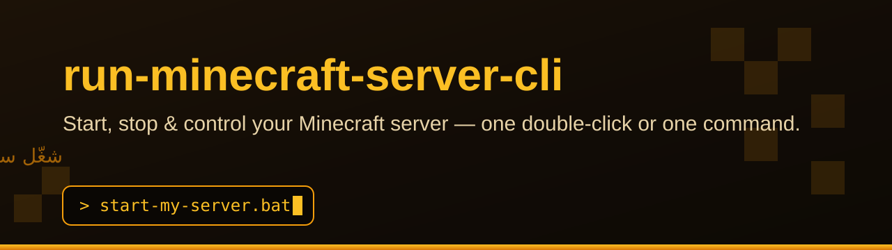
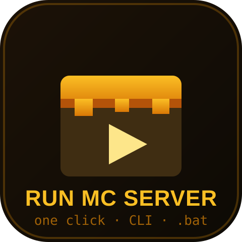
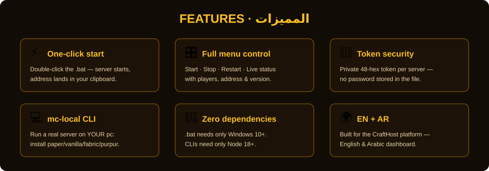
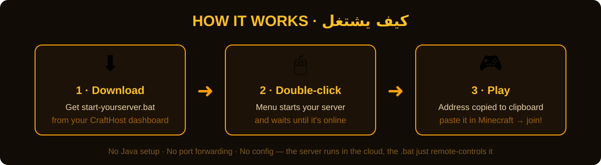
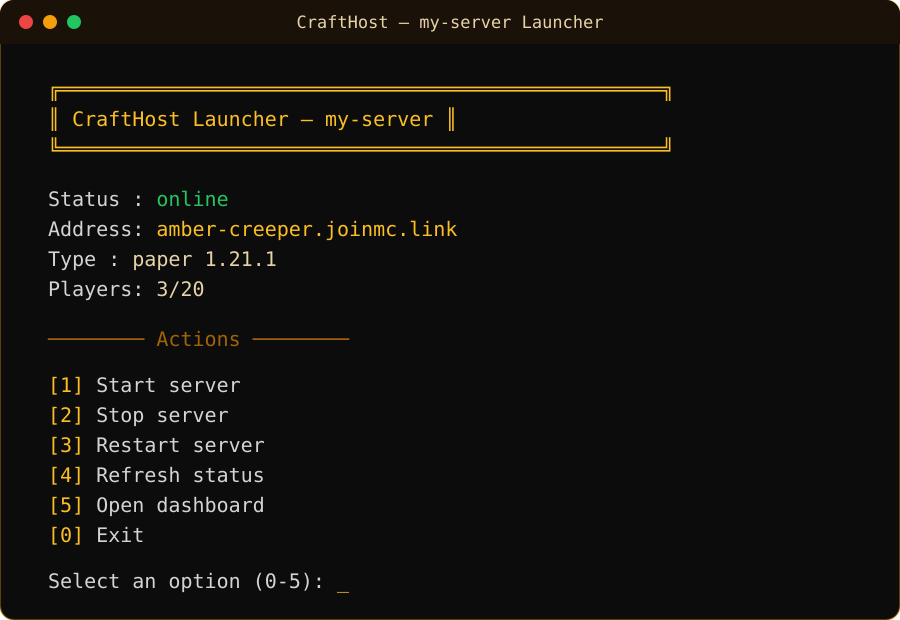

<p align="center">
  
</p>

# run-minecraft-server-cli

**Start, stop & control a Minecraft server — one double-click or one command.**
شغّل وتحكّم بسيرفر ماينكرافت — بضغطة واحدة أو بأمر واحد.

Made by the [CraftHost](https://crafthost-production.up.railway.app) team — free Minecraft hosting, English + Arabic.

<p align="center">
  
</p>

---

## What's inside

| Tool | What it does | Needs |
|---|---|---|
| **`launcher-template.bat`** | Windows one-click launcher for your **CraftHost cloud server**: menu with Start / Stop / Restart / live status, copies the join address to your clipboard | Windows 10+ (nothing else) |
| **`mc-local.mjs`** | Full CLI to run a Minecraft server **on your own machine**: downloads the jar, starts/stops it, console, backups | Node 18+ & Java |
| **`ch-cli.mjs`** | Terminal client for the CraftHost API — manage your cloud servers without opening the browser | Node 18+ |

<p align="center">
  
</p>

---

## 🚀 The one-click .bat launcher

The easiest way to run your server. No Java, no port forwarding, no configs — your server runs on CraftHost's cloud, the .bat just remote-controls it.

<p align="center">
  
</p>

1. Create your free server at **[CraftHost](https://crafthost-production.up.railway.app)** (takes ~30 seconds)
2. On your server card → menu → **"One-Click Starter (.bat)"** — downloads `start-<your-server>.bat` with your private token already inside
3. Double-click it on any Windows 10+ PC:

<p align="center">
  
</p>

When the server is online, the join address (like `amber-creeper.joinmc.link`) is **printed and auto-copied to your clipboard** — paste it in Minecraft → Multiplayer → Add Server → play.

`launcher-template.bat` in this repo is the same launcher with the token left blank, so you can read exactly what it does before trusting it, or wire it to your own token manually.

### How it talks to CraftHost

The .bat uses 4 tiny public endpoints, authenticated by a private 48-hex token unique to your server (revoked if you delete the server):

```
POST /api/launcher/<token>/start      → "OK starting" | "ERROR <reason>"
POST /api/launcher/<token>/stop       → "OK stopping"
POST /api/launcher/<token>/restart    → "OK restarting"
GET  /api/launcher/<token>/status     → status / address / type+version / players
```

Plain-text replies on purpose — `cmd.exe` + `curl` can parse them with zero dependencies.

---

## 💻 mc-local — run a server on YOUR machine

```bash
node mc-local.mjs install paper 1.21.1   # download the server jar
node mc-local.mjs init                   # create config + accept EULA
node mc-local.mjs start --ram 2048       # boot it (2 GB heap)
node mc-local.mjs console               # attach interactive console
node mc-local.mjs backup                # zip the world
node mc-local.mjs stop                  # graceful stop
```

Supported engines: **paper · vanilla · fabric · purpur**. Config lives in `mc-local.json`, created on `init`.

> Java 21 is required for Minecraft 1.21+, Java 17 for 1.18–1.20.

## ☁️ ch-cli — CraftHost from the terminal

```bash
export CRAFTHOST_API=https://crafthost-production.up.railway.app
node ch-cli.mjs login <user> <pass>
node ch-cli.mjs list                    # your servers + status
node ch-cli.mjs start <server-id>
node ch-cli.mjs stop <server-id>
```

---

## 📦 Public jar catalog API

Need a server jar without opening a browser? CraftHost exposes a free public catalog — **every engine, every version, direct downloads**. No key, no login.

```bash
BASE=https://crafthost-production.up.railway.app/api/jars/catalog

curl $BASE                          # everything: all engines + all versions
curl $BASE/paper?limit=10           # one engine (paper, vanilla, purpur, fabric, neoforge)
curl $BASE/paper/1.21.1             # resolved: direct URL + build number
curl -LO $BASE/paper/LATEST/download   # just download the jar
```

- `LATEST` works everywhere; `spigot` is an alias for paper
- `/download` 302-redirects to the official upstream jar (PaperMC, Mojang, PurpurMC, FabricMC, NeoForge maven) — always the latest build for that version
- NeoForge returns the **installer** jar: run `java -jar` once to extract the server

---

## FAQ

**Is it safe to share my .bat?** No — the token inside lets anyone start/stop (not delete) your server. Treat it like a key. Re-download from the dashboard if leaked (the token stays the same today — delete+recreate the server to rotate it).

**Does the .bat work on Mac/Linux?** The .bat is Windows-only, but the endpoints are plain curl — see the four URLs above.

**Does CraftHost cost money?** No. Free by design — cosmetic plan tiers only.

---

## Community & contact

- 💬 Discord: [discord.gg/zbHbSsCUua](https://discord.gg/zbHbSsCUua)
- 🐦 X: [@KhaledQ84Ever](https://x.com/KhaledQ84Ever)
- 📱 WhatsApp: [wa.me/96555828769](https://wa.me/96555828769)

## License

MIT © Khaled — see [LICENSE](LICENSE)
